# Доповнення до звіту: п.3–5 (Архітектура класів, заглушки, журнал версій)

**Тема:** «Подкасти та гості» · **Стек:** Python 3.12, FastAPI, asyncio (motor, elasticsearch-async, neo4j async driver, redis.asyncio)
**Дата цієї версії схеми:** 30.09.2026 (v1.0 — деталізація архітектури з Рис. 1 звіту)

Це доповнення деталізує Рис. 1 («Діаграма взаємодії модулів») до рівня класів і додає класи-заглушки, які реалізують саме цю схему: `Query API` / `Command API` → `Queries` / `Commands` → `IDocumentRepository` / `ISearchRepository` / `IGraphRepository` / `ICacheService` → конкретні асинхронні адаптери БД.

## 1. Відповідність вашій діаграмі (Рис. 1) та методичці

У методичці наведено приклад `MovieController → MovieFacade → Services → Repositories`. У вашій архітектурі роль «фасаду» виконують безпосередньо **CQRS-обробники** (`*Handler` для кожної команди/запиту) — це узгоджується з вашим власним Рис. 1, де `Queries`/`Commands` одразу звертаються до портів, без окремого фасадного шару. Це свідомий і коректний варіант гексагональної архітектури для CQRS-стилю.

## 2. Діаграма класів

```mermaid
classDiagram
  class IngestController
  class SearchController
  class PersonController
  class GeneratorController
  class StatsController

  class IngestEpisodeCommand
  class IngestBatchCommand
  class IngestPodcastCommand
  class UpdateGeneratorRateCommand
  class IngestEpisodeHandler
  class IngestBatchHandler
  class IngestPodcastHandler
  class UpdateGeneratorRateHandler

  class SearchEpisodesQuery
  class GetRecommendationsQuery
  class GetPodcastCardQuery
  class GetPersonProfileQuery
  class GetStatsQuery
  class SearchEpisodesHandler
  class GetRecommendationsHandler
  class GetPodcastCardHandler
  class GetPersonProfileHandler
  class GetStatsHandler

  class IDocumentRepository { <<port out>> }
  class ISearchRepository { <<port out>> }
  class IGraphRepository { <<port out>> }
  class ICacheService { <<port out>> }
  class IStatsService { <<port out>> }

  class MongoDocumentAdapter
  class ElasticsearchSearchAdapter
  class Neo4jGraphAdapter
  class RedisCacheAdapter
  class RedisStatsAdapter

  IngestController --> IngestEpisodeHandler
  IngestController --> IngestBatchHandler
  IngestController --> IngestPodcastHandler
  SearchController --> SearchEpisodesHandler
  SearchController --> GetRecommendationsHandler
  SearchController --> GetPodcastCardHandler
  PersonController --> GetPersonProfileHandler
  GeneratorController --> UpdateGeneratorRateHandler
  StatsController --> GetStatsHandler

  IngestEpisodeHandler --> IDocumentRepository
  IngestEpisodeHandler --> ISearchRepository
  IngestEpisodeHandler --> IGraphRepository
  IngestEpisodeHandler --> IStatsService
  IngestBatchHandler --> IDocumentRepository
  IngestBatchHandler --> ISearchRepository
  IngestBatchHandler --> IStatsService
  IngestPodcastHandler --> IDocumentRepository
  IngestPodcastHandler --> IGraphRepository

  SearchEpisodesHandler --> ISearchRepository
  SearchEpisodesHandler --> ICacheService
  SearchEpisodesHandler --> IStatsService
  GetRecommendationsHandler --> IGraphRepository
  GetRecommendationsHandler --> IDocumentRepository
  GetPodcastCardHandler --> IDocumentRepository
  GetPodcastCardHandler --> IGraphRepository
  GetPersonProfileHandler --> IGraphRepository
  GetPersonProfileHandler --> IDocumentRepository
  GetStatsHandler --> IStatsService
  UpdateGeneratorRateHandler --> IStatsService

  MongoDocumentAdapter ..|> IDocumentRepository
  ElasticsearchSearchAdapter ..|> ISearchRepository
  Neo4jGraphAdapter ..|> IGraphRepository
  RedisCacheAdapter ..|> ICacheService
  RedisStatsAdapter ..|> IStatsService
```



## 3. Ключові ланцюжки виконання (заміна прикладу з методички під ваш варіант)

**Ingest (запис, замість `MovieController → MovieFacade`):**
`IngestController → IngestEpisodeHandler → IDocumentRepository (Mongo) + ISearchRepository (ES) + IGraphRepository (Neo4j, link_guest) → IStatsService (Redis)`

**Пошук:**
`SearchController → SearchEpisodesHandler → ICacheService (normalize+get) → miss → ISearchRepository (ES) → ICacheService.put → IStatsService.log_search`

**Рекомендації (перетин гостей):**
`SearchController → GetRecommendationsHandler → IGraphRepository.recommend_by_shared_guests (Neo4j) → IDocumentRepository.get_episode (Mongo, для кожного id)`

**Керування швидкістю зі слайдера:**
`GeneratorController → UpdateGeneratorRateHandler → IStatsService (Redis, shared state) ← читає PodcastTextGenerator перед кожним batch`

## 4. Класи-заглушки (файлова структура)

```
podcast-platform/
├── domain/models.py                        # Podcast, Episode, Person, SearchQuery, SearchHit, GeneratorSettings, SystemStats
├── application/
│   ├── ports/                              # порти (ABC)
│   │   ├── document_repository.py          # IDocumentRepository — CRUD Mongo
│   │   ├── search_repository.py            # ISearchRepository — Elasticsearch
│   │   ├── graph_repository.py             # IGraphRepository — Neo4j
│   │   ├── cache_service.py                # ICacheService — Redis (пошук)
│   │   └── stats_service.py                # IStatsService — Redis (лічильники)
│   ├── commands/                           # CQRS write side
│   │   ├── ingest_episode_command.py
│   │   ├── ingest_batch_command.py
│   │   ├── ingest_podcast_command.py
│   │   └── update_generator_rate_command.py
│   └── queries/                            # CQRS read side
│       ├── search_episodes_query.py
│       ├── get_recommendations_query.py
│       ├── get_podcast_card_query.py
│       ├── get_person_profile_query.py
│       └── get_stats_query.py
├── adapters/
│   ├── in_web/                             # FastAPI: controllers + DTO + mappers
│   │   ├── dto.py
│   │   ├── mappers.py
│   │   ├── ingest_controller.py
│   │   ├── search_controller.py
│   │   ├── person_controller.py
│   │   ├── generator_controller.py
│   │   └── stats_controller.py
│   ├── out_mongo/mongo_document_adapter.py
│   ├── out_elasticsearch/elasticsearch_search_adapter.py
│   ├── out_graph/{neo4j_graph_adapter.py, postgres_graph_adapter.py}
│   └── out_redis/{redis_cache_adapter.py, redis_stats_adapter.py}
├── generator/podcast_generator.py          # окремий процес (Рис.1: 'Python Генератор')
└── bootstrap/main.py                       # composition root FastAPI
```

CRUD-репозиторій `IDocumentRepository` покриває Create (`save_*`), Read (`get_*`, `list_*`), Update (повторний `save_*` за тим самим id), Delete (`delete_*`) для `Podcast` і `Episode` окремо — за прикладом методички (`MovieInformationRepository`/`MoviePictureRepository`), тут відповідно розділені сутності Podcast/Episode всередині одного порту, а зв'язки Host/Guest — окремим портом `IGraphRepository`.

## 5. Журнал змін архітектури

| Дата | Версія | Зміна |
|---|---|---|
| (дата вашого Рис. 1 у звіті) | v0.1 | Початкова схема модулів (Query/Command API → Application Layer & Ports → Infrastructure Adapters → Поліглотне сховище) |
| **30.09.2026** | **v1.0** | Деталізація до рівня класів: додано діаграму класів, CQRS command/query handlers, класи-заглушки портів і адаптерів (Python/FastAPI) |
| _дата захисту_ | v_final_ | Фінальна схема після завершення реалізації — додати перед захистом |

## 6. Що лишилось відкритим (потребує вашого рішення для фінальної версії)

1. Neo4j чи PostgreSQL для зв'язків — заглушку зроблено для обох (`neo4j_graph_adapter.py`, `postgres_graph_adapter.py`), лишити один.
2. Формат зв'язку генератора з бекендом — прямий HTTP POST (як зараз у звіті) чи через черга (Kafka) — поточна заглушка передбачає прямий HTTP.
3. Спосіб передачі нового `rate_per_second` генератору — через shared-стан у Redis (як у заглушці) чи окремий керуючий ендпоінт самого скрипта-генератора.
