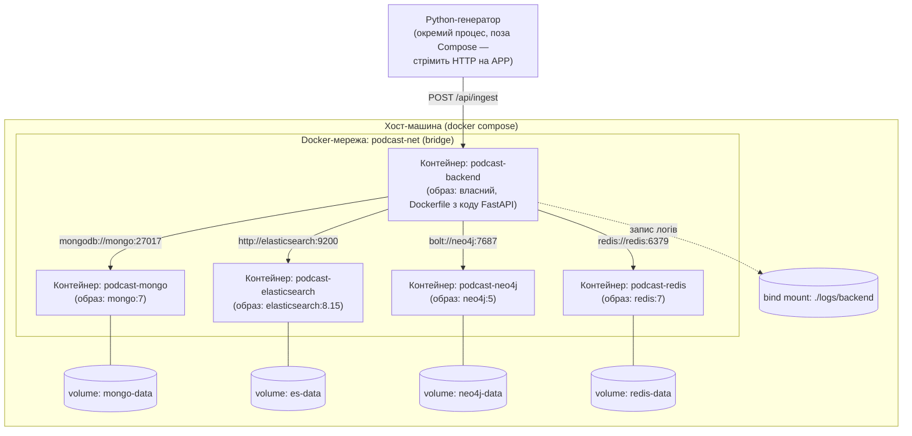

# Доповнення до звіту: Контейнеризація

**Дата додавання:** 03.10.2026 (v1.1 — додано контейнеризацію до архітектури)

## 1. Обґрунтування вибору технології контейнеризації

Для розгортання компонентів поліглотного сховища (MongoDB,
Elasticsearch, Neo4j, Redis) та бекенд-застосунку обрано **Docker** як
основну технологію контейнеризації, а **Docker Compose** — як засіб
декларативного опису топології з кількох контейнерів.

Обґрунтування вибору саме Docker (а не альтернатив):

| Критерій | Чому Docker підходить курсовій роботі |
|---|---|
| **Відтворюваність середовища** | Кожна з чотирьох БД (Mongo/ES/Neo4j/Redis) та сам бекенд мають різні рантайми й версії залежностей. Контейнер фіксує версію образу (`postgres:16`, `neo4j:5` тощо), тому результати навантажувального тестування відтворювані на будь-якій машині. |
| **Ізоляція поліглотного сховища** | Кожна БД — окремий контейнер з власним мережевим простором і volume; відмова чи перезапуск однієї БД не чіпає інші — важливо саме для Polyglot Persistence, яка лежить в основі архітектури. |
| **Простота мережевої взаємодії** | Docker-мережа (`bridge`) дає контейнерам DNS-розв'язання за іменами сервісів (`mongo`, `elasticsearch`, `neo4j`, `redis`, `backend`) без ручного налаштування IP — саме так реалізовано зв'язки на схемі нижче. |
| **Масштаб завдання** | Проєкт — одна навантажувальна машина для курсової роботи, не production-кластер. Docker Compose покриває потребу "підняти 5 сервісів одним `docker compose up`" без складності оркестрації Kubernetes. |
| **Чому НЕ Kubernetes/Swarm** | K8s виправданий для production-масштабування (авто-scaling подів Elasticsearch, rolling updates). Для курсової це невиправдано ускладнило б звіт і демонстрацію, не додавши нічого до розуміння архітектури БД, яке є метою роботи. |
| **Персистентність даних** | Docker **named volumes** (`mongo-data`, `es-data`, `neo4j-data`, `redis-data`) гарантують, що дані БД переживають перезапуск/перестворення контейнера — критично при навантажувальному тестуванні, де контейнери можуть рестартувати. |

## 2. Оновлена схема архітектури — з контейнерною топологією

Ключові архітектурні рішення, відображені на схемі:
- Усі БД-контейнери та бекенд перебувають в одній ізольованій мережі `podcast-net`, зв'язок — за іменами сервісів (service discovery вбудований у Docker, без хардкоду IP).
- Кожна БД має власний **named volume** — дані не губляться при `docker compose restart` чи перестворенні контейнера.
- Логи бекенду пишуться через **bind mount** (`./logs/backend` на хості) — на відміну від named volume, це дає прямий доступ до файлів логів з хост-машини без додаткових команд, що зручно під час налагодження навантажувального тестування.
- Генератор (скрипт-джерело даних) свідомо залишено **поза** Compose-топологією: це зовнішній клієнт системи, а не її внутрішній компонент, і це відповідає ролі "Вхідна точка" на початковій схемі архітектури (Рис. 1 звіту).

## 3. Практична частина (лабораторна робота з контейнерами)

Окремо від повної топології вище, виконано мінімальну лабораторну
роботу для перевірки навичок роботи з Docker "вручну": збірка
власного образу з кодом проєкту, запуск окремого контейнера БД
(PostgreSQL, реляційна — як дозволено завданням), зв'язування
контейнерів через Docker-мережу, запис і читання даних, перевірка
результату через логи з персистентністю на хост-машині (через
volume), включно з доказом, що лог переживає видалення контейнера.

Повні покрокові інструкції, код і Dockerfile — у доданих файлах
`docker-lab/README.md`, `docker-lab/app/demo_app.py`,
`docker-lab/app/Dockerfile`.

## 4. Журнал змін (оновлення)

| Дата | Версія | Зміна |
|---|---|---|
| 30.09.2026 | v1.0 | Деталізація архітектури до рівня класів (Python/FastAPI, CQRS) |
| **03.10.2026** | **v1.1** | Додано контейнеризацію: обґрунтування Docker/Compose, мережева топологія, volumes для БД і логів, виконана лабораторна робота з ручного запуску контейнерів |
| _дата захисту_ | v_final_ | Фінальна схема — додати перед захистом |
